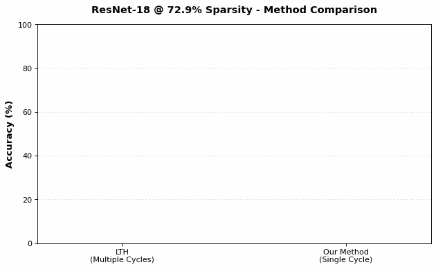
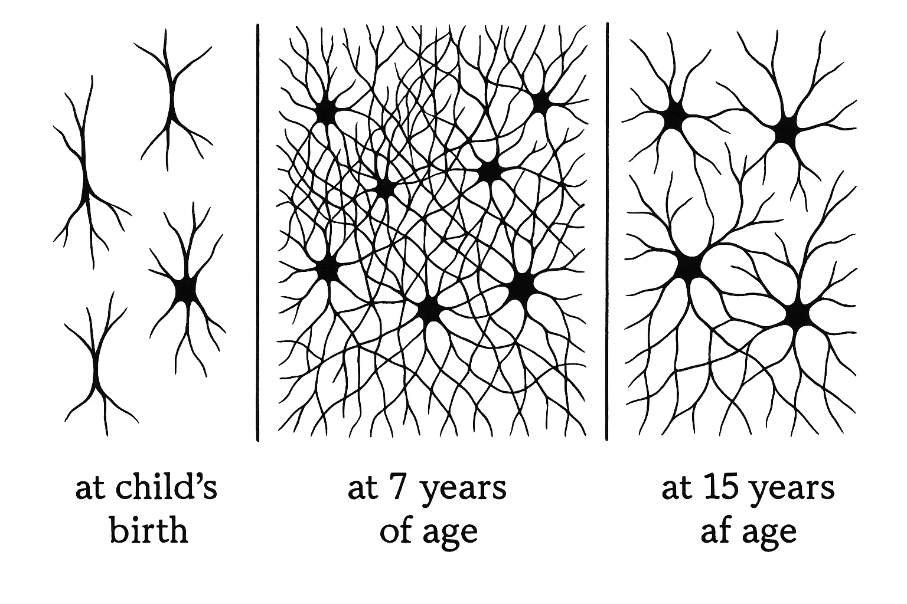
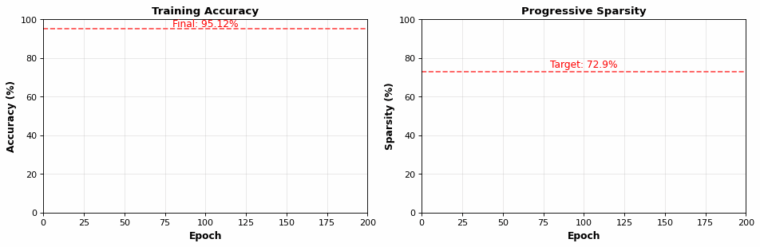
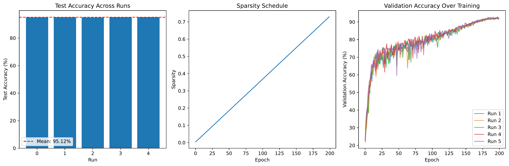
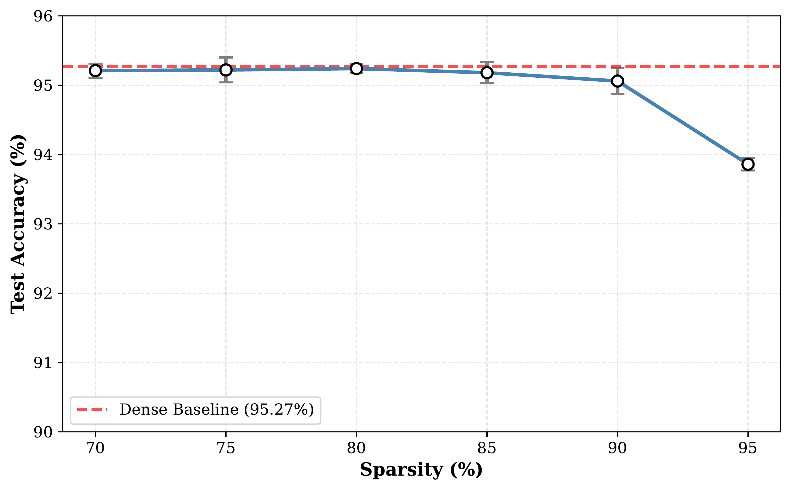
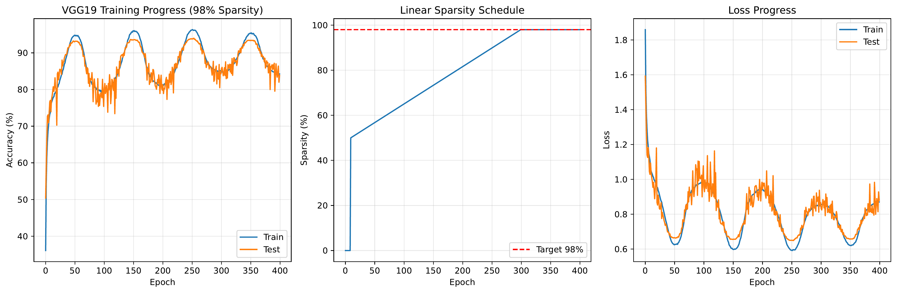
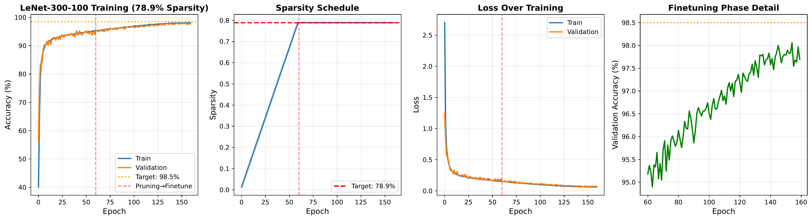
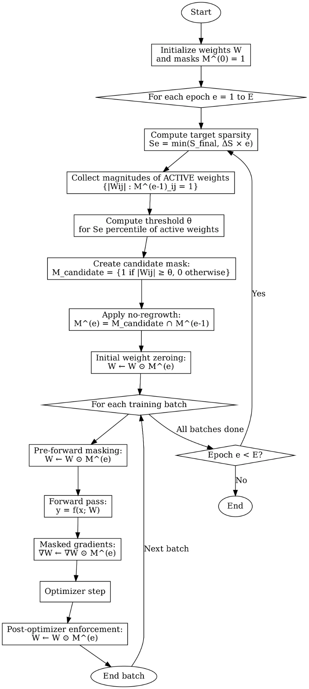

# Finding Dynamic Lottery Tickets in One Training Cycle 🎫

[](https://www.python.org/downloads/)
[](https://pytorch.org/)

> **Progressive magnitude-based pruning achieving superior performance compared to Lottery Ticket Hypothesis (LTH), SNIP, and GraSP - all within a single training cycle.**

---

## 📊 Key Results

<div align="center">

### ResNet-18 on CIFAR-10 @ 72.9% Sparsity

| Method | Training Cycles | Accuracy | Improvement |
|--------|----------------|----------|-------------|
| **LTH** (Baseline) | Multiple | 90.5% | - |
| **Our Method** | **Single** | **95.12% ± 0.09%** | **+4.62pp** ✨ |



</div>

### 🎯 Key Achievements

- ✅ **95.12% ± 0.09%** accuracy on ResNet-18 @ 72.9% sparsity (vs LTH's 90.5%)
- ✅ **93.13%** on VGG-like @ 97% sparsity (vs SNIP's ~92.0%)
- ✅ **93.44%** on VGG-19 @ 97.97% sparsity (vs GraSP's 92.19% @ 98%)
- ✅ **98.88%** on LeNet-300-100 @ 78.9% sparsity on MNIST
- ✅ **Single training cycle** - no expensive iterative pruning
- ✅ **70-85% optimal sparsity range** with < 0.1pp accuracy drop

---

## 🔬 What is Progressive Dynamic Pruning?

Progressive dynamic pruning gradually removes connections during training based on weight magnitudes, allowing the network to adapt naturally to increasing sparsity constraints.

### Why It Works Better

```
Traditional LTH:        Train → Prune → Reset → Train → Prune → Reset → ...
                        (Multiple complete training cycles)

Our Method:             Train with Progressive Pruning
                        (Single training cycle, adaptive mask updates)
```

**Key Innovation:**
- Computes pruning thresholds from **currently active weights only**
- Enforces **monotonic sparsity** (no regrowth complexity)
- Uses **linear scheduling** for predictable behavior
- Achieves better results in less time

### Biological Inspiration

<div align="center">
  
  <p><em>Synaptic pruning in brain development: Progressive elimination of connections mirrors our approach</em></p>
</div>

---

## 📈 Training Dynamics

### Progressive Training Animation

<div align="center">
  
  <p><em>Figure 1: Real-time visualization of progressive pruning - accuracy increases while sparsity grows linearly over 200 epochs</em></p>
</div>

### ResNet-18 @ 72.9% Sparsity - Detailed Results

<div align="center">
  
  <p><em>Figure 2: Progressive pruning maintains high accuracy (95.12%) across 5 different random seeds</em></p>
</div>

### Sparsity-Accuracy Trade-off

<div align="center">
  
  <p><em>Figure 3: ResNet-18 on CIFAR-10 - Optimal range: 70-85% sparsity maintains accuracy within 0.1pp of dense baseline (95.27%)</em></p>
</div>

### VGG-19 @ 98% Sparsity

<div align="center">
  
  <p><em>Figure 4: VGG-19 achieves 93.44% accuracy at 97.97% sparsity, outperforming GraSP's 92.19% at 98%</em></p>
</div>

### LeNet on MNIST

<div align="center">
  
  <p><em>Figure 5: LeNet-300-100 reaches 98.88% at 78.9% sparsity, surpassing LTH's ~98.5%</em></p>
</div>

---

## 📈 Complete Results Summary

### CIFAR-10 Performance

<div align="center">

| Architecture | Method | Sparsity | Accuracy | Params Remaining | Seeds |
|-------------|--------|----------|----------|------------------|-------|
| **ResNet-18** | Dense Baseline | 0% | 95.27% | 11.2M (100%) | 1 |
| **ResNet-18** | **Our Method** | 70% | **95.21% ± 0.10%** | 3.36M (30%) | 5 |
| **ResNet-18** | **Our Method** | 75% | **95.22% ± 0.18%** | 2.80M (25%) | 5 |
| **ResNet-18** | **Our Method** | 80% | **95.24% ± 0.06%** | 2.24M (20%) | 5 |
| **ResNet-18** | **Our Method** | 85% | **95.18% ± 0.15%** | 1.68M (15%) | 5 |
| **ResNet-18** | **Our Method** | 90% | **95.06% ± 0.19%** | 1.12M (10%) | 5 |
| **ResNet-18** | **Our Method** | 95% | **93.86% ± 0.09%** | 560K (5%) | 5 |

</div>

#### Comparison with Baselines

| Architecture | Baseline Method | Sparsity | Baseline Acc. | Our Accuracy | Improvement |
|-------------|----------------|----------|---------------|--------------|-------------|
| ResNet-18 | LTH | 72.9% | 90.5% | **95.12% ± 0.09%** | **+4.62pp** 🎯 |
| VGG-like | SNIP | 97% | ~92.0% | **93.13%** | **+1.13pp** |
| VGG-19 | GraSP | 98% | 92.19% ± 0.12% | **93.44%** @ 97.97% | **+1.25pp** |

### MNIST Performance (LeNet-300-100)

| Method | Sparsity | Accuracy | Params Remaining |
|--------|----------|----------|------------------|
| LTH | 78.9% | ~98.5% | 56.1K (21.1%) |
| **Our Method** | 78.9% | **98.88%** | 56.1K (21.1%) |
| SNIP | 98% | 97.6% | 5.32K (2%) |
| **Our Method** | 98% | **98.35%** | 5.32K (2%) |

---

## 🔬 Methodology

### Progressive Pruning Algorithm

<div align="center">
  
  <p><em>Figure 6: Complete flowchart of progressive dynamic pruning with monotonic mask updates</em></p>
</div>

Our approach uses a simple yet effective three-step process at each training epoch:

1. **Compute Target Sparsity** (Linear Schedule)
   ```
   s(t) = s_initial + (s_target - s_initial) × (t - t_start) / (t_end - t_start)
   ```

2. **Update Pruning Mask**
   - Collect magnitudes of currently **active weights only**
   - Compute global threshold for (1 - s) quantile
   - Create candidate mask: keep weights above threshold
   - **Enforce no-regrowth**: intersect with previous mask

3. **Multi-Stage Mask Enforcement**
   - Pre-forward: Apply mask to weights
   - During backward: Mask gradients
   - Post-optimizer: Re-apply mask (critical for momentum!)

### Key Design Choices

- ✅ **Linear scheduling**: Predictable, stable, easy to configure
- ✅ **Magnitude-based criterion**: Simple, efficient, effective
- ✅ **Monotonic pruning**: Once removed, connections stay pruned
- ✅ **Global thresholding**: Automatic per-layer sparsity allocation

---

## 📁 Repository Structure

```
progressive-pruning/
├── README.md                                    
├── requirements.txt                             
│
├── experiments/                                 # Jupyter notebooks
│   ├── ResNet18_Cifar10_sparsity_72.9_multipleSeeds.ipynb
│   ├── Resnet18_Sparsity70_Cifar10_multipleSeeds_cifar10_code.ipynb
│   ├── Resnet18_Sparsity75__MultipleSeeds_Cifar10_code.ipynb
│   ├── Resnet18_Sparsity80%_with_multiple_Seeds_cifar10_Code.ipynb
│   ├── Resnet18_sparsity85_multipleseeds_Cifar10.ipynb
│   ├── Resnet18_sparsity90_cifar10_multipleSeeds.ipynb
│   ├── Resnet18_sparsity95_cifar10_multipleSeeds.ipynb
│   ├── VGG_like_Sparsity97_Cifar10.ipynb
│   ├── VGG19_Sparsity98_Cifar10.ipynb
│   ├── LeNet_300_100_78.9%Sparsity.ipynb
│   ├── LeNet_300100_98Sparsity.ipynb
│   ├── sparsity_accuracy_TradeOff.ipynb
│   └── Dense_Baseline_Compare.ipynb
│
├── results/                                     # Experimental results (PDFs)
│   ├── cifar10_results_70_sparsity_results.pdf
│   ├── cifar10_results_72.9_sparsity.pdf
│   ├── cifar10_results_75_sparsity.pdf
│   ├── cifar10_results_85_sparsity.pdf
│   ├── cifar10_results90sparsity.pdf
│   ├── cifar10_results95sparsity.pdf
│   ├── lenet_78.9_sparsity_results.pdf
│   ├── lenet_98_sparsity_results.pdf
│   └── Final_VGG19_Sparsity98.pdf
│
└── assets/                                      # Figures for README
    ├── training_animation.gif               # NEW! Animated training
    ├── comparison_animation.gif             # NEW! Method comparison
    ├── resnet18_training.png
    ├── sparsity_tradeoff.png
    ├── vgg19_training.png
    ├── lenet_training.png
    ├── algorithm_flowchart.png
    └── biological_inspiration.png
```

---

## 📊 Experimental Details

### Training Configuration

**CIFAR-10:**
- Optimizer: SGD (momentum=0.9, weight_decay=5e-4)
- Learning rate: 0.1 with cosine annealing
- Batch size: 128
- Data augmentation: Random crop, horizontal flip, color jitter
- Training epochs: 200 (ResNet-18), 350 (VGG-like), 400 (VGG-19)

**MNIST:**
- Optimizer: SGD (momentum=0.9, weight_decay=5e-4)
- Learning rate: 0.01
- Batch size: 128
- Training epochs: 160-200

### Reproducibility

All ResNet-18 experiments run with **5 random seeds** (42, 123, 456, 789, 999) for statistical validation.

---

## 🔑 Key Contributions

1. **Comprehensive Evaluation**: First systematic comparison of progressive pruning against LTH, SNIP, and GraSP on standard benchmarks

2. **Superior Performance**: Achieve 4.62pp improvement over LTH on ResNet-18, demonstrating single-cycle efficiency

3. **Extreme Sparsity**: Maintain competitive accuracy at 97-98% sparsity, outperforming sophisticated initialization methods

4. **Optimal Range Identification**: Statistical validation identifying 70-85% as optimal operating range with <0.1pp degradation

---

## 💡 Why Our Method Works

### Advantages Over Existing Approaches

**vs. Lottery Ticket Hypothesis (LTH):**
- ✅ Single training cycle vs. multiple iterations
- ✅ Better final accuracy (95.12% vs. 90.5%)
- ✅ Maintains learned information (no weight reset)

**vs. SNIP/GraSP (Initialization-based):**
- ✅ Adaptive during training vs. fixed at initialization
- ✅ Better extreme sparsity performance (97-98%)
- ✅ Weight magnitudes evolve with learning

**vs. Dynamic Sparse Training (SET/RigL):**
- ✅ Simpler implementation (no regrowth complexity)
- ✅ Competitive results with monotonic pruning
- ✅ Predictable behavior with linear scheduling

---

## 📊 Detailed Results

### ResNet-18 Sparsity Sweep (5 Seeds Each)

| Sparsity | Mean Accuracy | Std Dev | Accuracy Drop | Params | Status |
|----------|---------------|---------|---------------|---------|---------|
| 0% (Dense) | 95.27% | - | - | 11.2M | Baseline |
| 70% | 95.21% | ±0.10% | -0.06pp | 3.36M | ✅ Optimal |
| 75% | 95.22% | ±0.18% | -0.05pp | 2.80M | ✅ Optimal |
| 80% | 95.24% | ±0.06% | -0.03pp | 2.24M | ✅ Optimal |
| 85% | 95.18% | ±0.15% | -0.09pp | 1.68M | ✅ Optimal |
| 90% | 95.06% | ±0.19% | -0.21pp | 1.12M | ⚠️ Acceptable |
| 95% | 93.86% | ±0.09% | -1.41pp | 560K | ⚠️ Slightly Degraded |

**Optimal Range:** 70-85% sparsity maintains accuracy within 0.1pp of dense baseline


---

## 🤝 Contributing

Contributions are welcome! Areas of interest:
- Extension to larger datasets (ImageNet)
- Integration with other compression techniques
- Application to transformer architectures
- Hardware-aware pruning strategies

---

## 📧 Contact

**Romana Qureshi** - Graduate Researcher in Efficient AI  
Master of Science in Artificial Intelligence, King Saud University  
[rq.romana@gmail.com](mailto:rq.romana@gmail.com)

---

<div align="center">

**⭐ Star this repository if you find it helpful! ⭐**

[💬 Issues](../../issues) • [🔧 Contribute](../../pulls)

</div>
